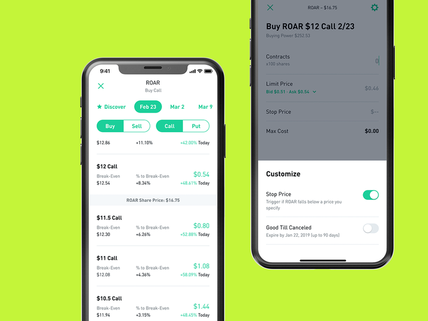

# Case-Study Robinhood

## Investing made for retailers: A Deep Dive Into The Robinhood App and Its Appeal to Retail Investors ##

---

## What is the background of your company? What do they do? Who are their competitors? ##

Robinhood is a digital discount brokerage trading and investing platform. Gives affordable access to investment opportunities to the average person. Their competitors include acorns, etrade, and in a larger case JP Morgan.

## How does this company use technology to their advantage? Why are they considered a FinTech company?## 

On an accessibility side it lets everyday people be able to trade on-demand and at a low cost. Continuing on that note it provides users with one local area to complete the transaction in their control without having to rely on too much human expertise.

## Why is this company exemplary in the FinTech space? What are their strengths and weaknesses? ## 

Robinhood is exemplary in the fintech space due to their commission free fee structure which enables retailers to enter into investing without a high barrier to entry. This effect can be seen in the emergence of meme stocks. 

The strengths of the business is their no commission fee structure, easy to use mobile app, and educational tools that makes understanding more sophisticated trading strategies a bit easier.

## What is the prognosis for this company? Where do they expect to be in the future?## 
Robinhood eventually expects to be one of the largest retailers in the world. Overtaking traditional retailers like ETrade and other traditional platforms. In addition, they aim to incorporate more cryptocurrencies to the ones they already support (Bitcoin, etherium, Litecoin, etc.)

Robinhood may eventually look to get into robo advising as well, as that seems to be a clear path to expanding their business. 

